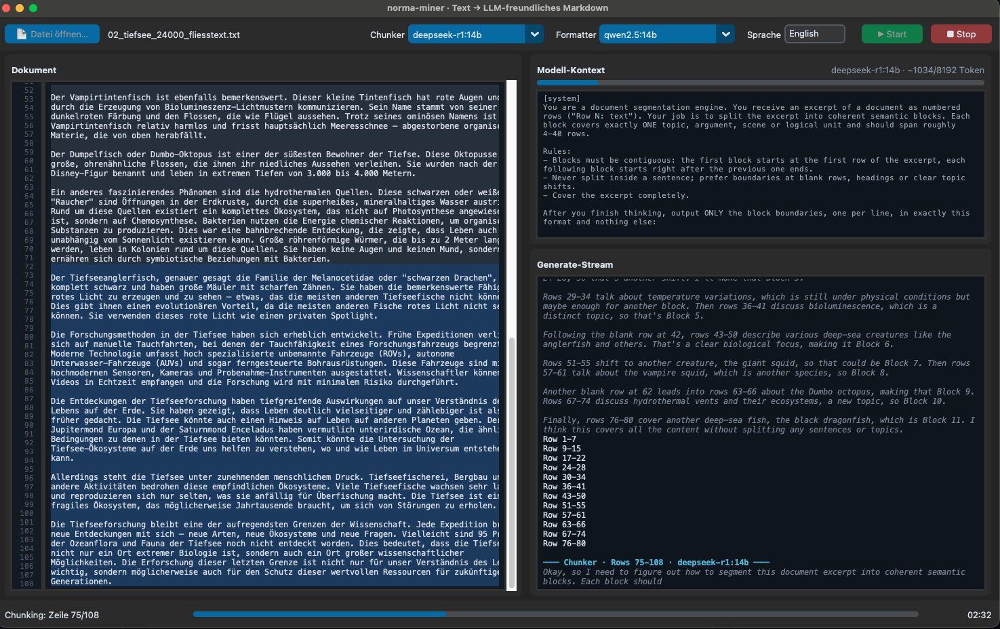
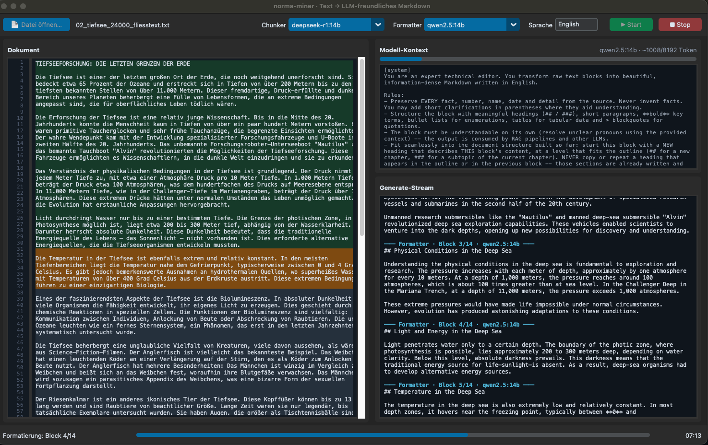

# norma-miner

[](README.md)

**Turn any text (PDF/TXT/MD) into beautiful, information-rich, RAG-/LLM-friendly Markdown using local LLMs — with a live monitor GUI.**



*Stage 1 · chunking: The thinking model (deepseek-r1) works through the document window by window (blue highlight on the left). On the right you watch it reason live — followed by its final answer: nothing but `Row A-B` ranges.*



*Stage 2 · formatting: The current block is highlighted orange, finished blocks are green. Top right the full prompt with context fill level, bottom right the Markdown stream — here with English as the target language for a German source text.*

A two-stage pipeline, fully local via [Ollama](https://ollama.com):

```
 PDF / TXT / MD
      │
      ▼
 ┌─────────────────────────────┐
 │ Extraction & normalization  │  number the lines (Row 1, Row 2, …)
 └─────────────────────────────┘
      │
      ▼
 ┌─────────────────────────────┐   Stage 1 · thinking model (e.g. deepseek-r1)
 │ Semantic chunker            │   receives a window of numbered lines and
 │ "Row 1-24" / "Row 25-64" …  │   answers ONLY with semantic block boundaries.
 └─────────────────────────────┘   The window moves until the document is done.
      │
      ▼
 ┌─────────────────────────────┐   Stage 2 · strong text model (e.g. qwen2.5)
 │ Markdown formatter          │   transforms each block into structured,
 │ block by block              │   self-contained Markdown.
 └─────────────────────────────┘
      │
      ▼
 output/<name>.md   (blocks separated by `---` → directly RAG-chunkable)
```

## Features

- **Row-protocol chunking**: The thinking model sees numbered lines and, after reasoning, outputs nothing but `Row A-B` ranges. Responses are parsed, repaired (gapless, strictly progressing) and oversized blocks are re-split at blank lines. If the answer is unusable, a fallback kicks in — the pipeline never stalls.
- **Overlapping blocks allowed**: If a semantic boundary falls *in the middle of a line*, the chunker may overlap (`Row 1-24`, `Row 24-64`, capped by `max_overlap_lines`) — the shared line lands in both blocks. Since the formatter sees the finished previous block, it never writes the overlap twice but uses it for smooth transitions.
- **Token-limit safe**: The chunker moves through the document window by window (`window_lines`, selectable in GUI/CLI). Since the text continues invisibly beyond the window edge, it **always deliberately leaves a tail of rows uncovered** — its last block ends at the last confident boundary well before the edge. The pipeline starts the next window right after the last complete block, which then sees that tail together with its continuation. If the model does span to the edge anyway, the last block is dropped as a safety net and re-evaluated. Only the final window must cover through the end of the document.
- **Monitor GUI (CustomTkinter)**: On the left the document — the chunker window (blue), the block currently being formatted (orange) and finished blocks (green) travel live through the document. Top right the **model context** (full prompt + context fill level), bottom right the **generate stream** including thinking (gray italic).
- **RAG-/LLM-friendly output**: Compression without loss — filler words, redundancy and rhetorical flourishes are stripped, every piece of information is kept. Dense structures (**term:** fact lists, tables) are preferred over retold prose. Every block is understandable on its own (pronouns resolved, context provided) and faithful to the facts. Blocks are separated by `---` — which directly matches the `marker: "---"` chunking of the text-embedder project.
- **Structural context for the formatter**: While formatting, the model always sees (a) the **previously formatted block** (clearly declared as "the text before", size via `prev_block_chars`) and (b) the **full chapter outline so far** (`#` / `##` / `###` with the current position). This keeps heading hierarchy, tone and terminology consistent across block boundaries. If the outline grows too long, it is automatically reduced to `#`/`##` — the prompt stays safely below `num_ctx`.
- **Sequential stages**: Stage 1 first chunks the entire document, then stage 2 formats — each model is loaded only once (important with 24 GB RAM, no model thrashing).
- **Language & models configurable** via `config.json` or directly in the GUI header.
- **Abort-safe**: Output is written after every block; pressing Stop preserves progress.

## Installation

```bash
cd norma-miner
python3 -m venv .venv && source .venv/bin/activate
pip install -r requirements.txt

# Ollama + models (recommendation for 24 GB RAM):
ollama pull deepseek-r1:14b    # chunker (thinking)
ollama pull qwen2.5:14b       # formatter
```

### Model recommendations for 24 GB RAM

| Role       | Recommendation       | Alternative                        |
|------------|----------------------|------------------------------------|
| Chunker    | `deepseek-r1:14b`    | `qwen3:14b`, `deepseek-r1:8b` (faster) |
| Formatter  | `qwen2.5:14b`        | `gemma3:12b`, `llama3.1:8b` (faster)   |

Both 14b models (q4) take ~9–10 GB each — since the stages run one after another, only one is loaded at a time.

## Usage

**GUI (recommended):**

```bash
python main.py          # or: python app.py
```

1. `📄 Datei öffnen…` → choose a PDF/TXT/MD
2. Optionally adjust models/language in the header
3. `▶ Start` — watch the highlight travel through the document
4. Result: `output/<name>.md`

**Headless/CLI:**

```bash
python main.py --cli document.pdf              # with config.json values
python main.py --cli document.pdf --window 60  # override the chunker window
```

## Configuration (`config.json`)

```jsonc
{
  "ollama_url": "http://localhost:11434",
  "language": "Deutsch",          // target language of the Markdown output
  "output_dir": "./output",
  "wrap_width": 100,              // line wrapping before row numbering
  "chunker": {
    "model": "deepseek-r1:14b",
    "think": true,                // request native thinking (fallback: <think> tags are filtered)
    "num_ctx": 8192,              // context window
    "temperature": 0.2,
    "window_lines": 100,          // lines per chunker window (token limit!) — also selectable in the GUI ("Fenster") and via --window
    "min_chunk_lines": 4,
    "max_chunk_lines": 40,
    "max_overlap_lines": 3        // blocks may overlap by up to N lines (0 = off)
  },
  "formatter": {
    "model": "qwen2.5:14b",
    "num_ctx": 8192,
    "temperature": 0.4,
    "num_predict": 4096,          // max output tokens per block
    "prev_block_chars": 4000      // how much of the previous Markdown block is passed as context
  }
}
```

**Rule of thumb for `window_lines`:** With `wrap_width: 100`, 100 lines ≈ 3,000 tokens — together with the prompt this stays comfortably below `num_ctx: 8192`. Larger context window? Increase `window_lines` and the chunker sees more coherence.

## Project structure

| File               | Purpose                                                       |
|--------------------|---------------------------------------------------------------|
| `main.py`          | Entry point: GUI or `--cli`                                   |
| `app.py`           | CustomTkinter monitor (document highlight, context, stream)   |
| `pipeline.py`      | Orchestrates the two stages, event system, file output        |
| `chunker.py`       | Row protocol: prompt, parsing, repair, fallback               |
| `formatter.py`     | Markdown prompt (faithful, RAG-friendly, target language)     |
| `ollama_client.py` | Streaming client, thinking handling (`think` + `<think>` tags) |
| `extract.py`       | PDF/TXT/MD → normalized lines (pymupdf, fallback pypdf)       |
| `config.json`      | Models, language, window and block sizes                      |

## Troubleshooting

- **"Ollama not reachable"** → is `ollama serve` running? Is the URL in `config.json` correct?
- **Chunker produces nonsense** → smaller window (`window_lines`), lower temperature, or a stronger thinking model. The blank-line fallback kicks in anyway if needed.
- **Very slow** → choose smaller models (8b/12b); thinking models naturally take longest for the reasoning part.
- **PDF yields garbled characters** → scanned PDF without a text layer; run OCR first (e.g. `ocrmypdf`).

## License

[MIT](LICENSE) © 2026 Lino Bugia
